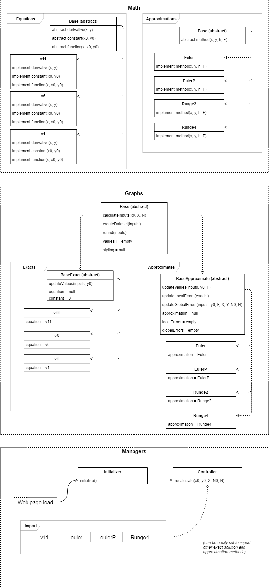

# DE Computational practicum

**Links:**

- [GitHub pages hosted web-app](https://alkaitagi.github.io/INNO-F19-DE/)
- [Repository with source code and this report](https://github.com/alkaitagi/INNO-F19-DE)

**Table of contents:**

- [DE Computational practicum](#de-computational-practicum)
  - [1. Analytical soltuion](#1-analytical-soltuion)
    - [1.1 Initial system](#11-initial-system)
    - [1.2 General solution](#12-general-solution)
    - [1.3 Initial value problem](#13-initial-value-problem)
    - [1.4 Discontuinuity points](#14-discontuinuity-points)
    - [1.5 Final system](#15-final-system)
  - [2. Function analysis](#2-function-analysis)
  - [3. Implementation](#3-implementation)
    - [3.1 Managers](#31-managers)
    - [3.2 Math classes](#32-math-classes)
    - [3.3 Graph classes](#33-graph-classes)
    - [3.4 UML diagram](#34-uml-diagram)

## 1. Analytical soltuion

### 1.1 Initial system

### 1.2 General solution

using variable separation:

using partial fraction decomposition:

squaring both side:

substiute :

### 1.3 Initial value problem

substituting:

and we can obtain general formula for :

since  is positive, we pick  sign and partucilar soltuion is:

### 1.4 Discontuinuity points

The particular function has no discontinuity points on the given interval. However on the global scale the function is not defined when .

### 1.5 Final system

These equations were implemented in the code:

## 2. Function analysis

With our initial condition  exact solution yeidls value in the range of  (rounding results to 3 decimals). It can be observed how  was correctly computed as well.

If number of grid steps for approximations is decreased (N=5) behaviour of the methods can be seen more clearly. There at the point  all of the methods (that are *Runge-Kutta* 4th order, *Euler improved* and *Euler*) achieve particularly good approximation, before diverging right after.

Same result can be obtained on the dedicated *Local errors* chart:

And appearance of *Global errors* chart renders to be correct as they diminish while we increase the steps number:

## 3. Implementation

The application was developed as a web page with JavaScript implemented logic. All the scripts can be divided into 3 cathergories:

- managers
  - conroller
  - initializer
- math classes
  - appromixations
  - equations
- graph classes
  - approximate
  - exact

Most importantly, an attempt was made to generalizing framework both *equations* and *approximations* so that adding any new variant of them would be easy and their number could scale without arising the need for modifying the framework itself.

### 3.1 Managers

**Initializer.js** module provides setup functoinality by assigning callbacks to UI input fields changes that will trigger mathematical computations. It also references objects needed for drawing and assigns common chart options.

**Controller.js** module accepts 5 input numbers (x0, y0, X, N0, N) and then passes them into exported exact solution and approxmaions. After all the computations are finished it draws graphs using resulting arrays of values. Also displays the constant value found by the initial condions.

### 3.2 Math classes

All of math classes divide into 2 cathegories.

**Approximations** provide singe method that accepts a point [x, y], grid step [h] and derivative function [y'(x,y)] and then utilizing its defined algorithm return approximated numerical value.

**Equations** can implement any particular variant from the practicum by providing 3 discting functions: *derivative(x,y)*, *constant(x0,y0)*, *function(x, x0 ,y0)*. These functions later utilized in *exact* graphs. The *derivate* function also passed into *approxmate* graphs.

### 3.3 Graph classes

These classes as well divide into 2 cathegories to wrap around the corresponding math classes.

Each graph contains *styling* object, *values* numerical array, and utility 3 functions:

- **round** rounds array of numbers
- **createDataset** that wraps styling around array of numbers to be plugged into chart object for drawing.
- **calculateInputs** returns array of x-values that later are used as inputs for *approximate* and *exact* graphs.

In addition to these, each graph type has its distinct features:

**Approximate** graph wraps around *approximation* math class. As such, it can store on instance of particular *approximation* that later will be used for updating its approximation *values*, *localErrors* and *globalErrors* in its corresponding methods.

**Exact** graph wraps around *exact* math class. Therefore it contains variable for storing such class instance. This instance's methods are later used for computing particular solution through finding constant by initial conditions, as well as the whole set of exact values of the function on the given set.

### 3.4 UML diagram

The systems described above can be inspected in the following UML diagram of high-level class overview (private members are hidden).

